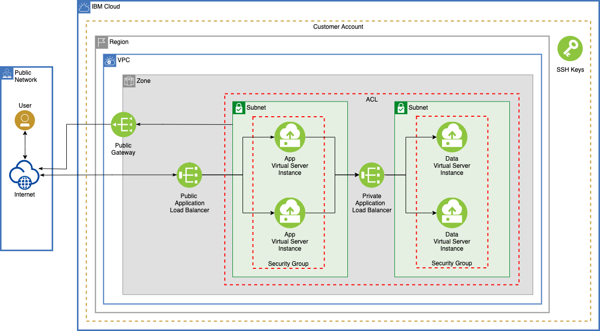

## Deploy Basic Networking for IBM Cloud VPC with Terraform

Deploy a VPC with multiple subnets, public and private application load balancers, ACLs, public gateway, and virtual servers with security groups using Terraform.

### Architecture

### Prerequisites

1. Complete the [IBM Cloud Terraform tutorial](https://www.ibm.com/cloud/garage/tutorials/public-cloud-infrastructure) prior to running this example. 

2. Obtain the variable values need in the [variables.tf](./infrastructure_code/network.tf) file.

3. Refer to [IBM Cloud documentation on VPC](https://cloud.ibm.com/docs/vpc) for detailed information.

### Steps to deploy this asset

<!---
1. **Build** the IBM Cloud Terraform docker container using the steps in the tutorial noted above.
   - Log into the Docker container.
   - Clone this repository.
     `$ git clone https://github.com/ibm-cloud-architecture/refasset-public-VPC-basic-networking`
-->

1. **Deploy** this solution to IBM Cloud.

   - Change directory to the folder containing terraform files - [./infrastructure_code](./infrastructure_code).
   - Review the terraform files in that folder.
   - Edit versions.tf and update the versions of Terraform and IBM Cloud Terraform Provider. 
   - Edit variables.tf and update the values for iaasapikey, ssh-key, and other variables as desired.
   - Run Terraform (init, plan, apply).

<!---
3. **Test** the deployment
   - To test the deployment, you can [use these steps](https://github.com/ibm-cloud-architecture/tutorial-vpc-3tier-networking/blob/master/WebApp.md) to install and run a 3-tier application. 

 4. **Enjoy!**
-->
